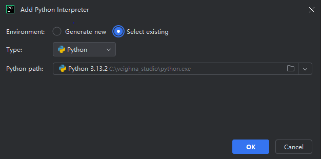
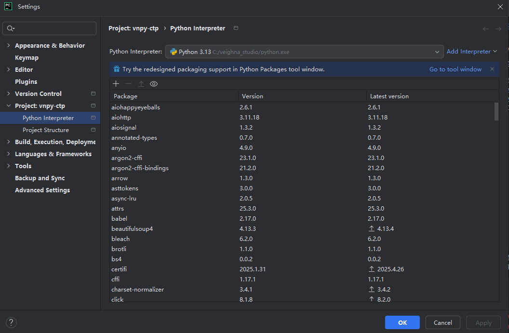
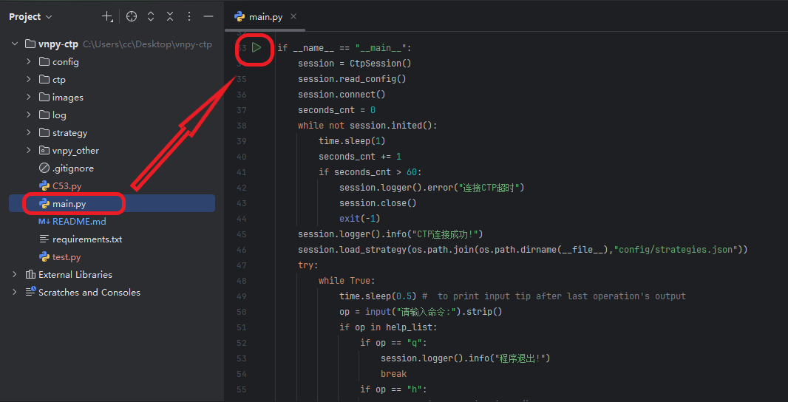

# 环境配置教程

## Step 1. 下载 VeighNa Station(https://download.vnpy.com/veighna_studio-4.0.0.exe)并安装

## Step 2. 使用其中的 python 环境

## 例如 在 pycharm 中 

- ### 左上角File -> Settings -> Project -> Python Interpreter -> Add Interpreter -> Add Local Interpreter, 添加本地 Python 解释器
- ### Python path 选择你安装的 VeighNa Station 的 python 解释器, 例如 C:\veighna_studio\python.exe, 点击确认(OK)
    
- ### 此时显示的 Python 版本应为 3.13, 再点击确认(OK)
    

## Step 3. 安装第三方库

- ### 首次打开项目根目录下的 requirements.txt 时应该会在文件上方提示安装, 直接点击即可.
  ### 或者
- ### 使用 pip 手动安装: 在命令行输入 pip install -r ./path/to/requirements.txt -i https://pypi.tuna.tsinghua.edu.cn/simple/

## Step 4. 配置账号信息 

- ### 根据个人账号和经纪商配置 config/config.ini
- ### 注意当使用 [datafeed] 下的 platform 指定为 tushare 时, username 为你的手机号, password 为 你的token (请前往tushare官网,登录后在个人主页中查询)

## Step 5. 运行主程序 main.py

- ### 例如你可以点击右上角 Current File -> Edit Configurations 添加新的程序运行配置
  ### 或者
- ### 简单点: 打开项目根目录下的 main.py, 找到运行入口, 点击左边的绿色开始三角, 直接运行
    

# =======================================

# 使用教程

- ### 主程序 main.py 启动后输入 h 查看帮助, 根据提示进行操作
- ### 提示 "策略记录文件已存在,是否覆盖?" 时, 如果你想要用当前策略(包括仓位等状态)覆盖原有策略则输入y, 否则输入n
